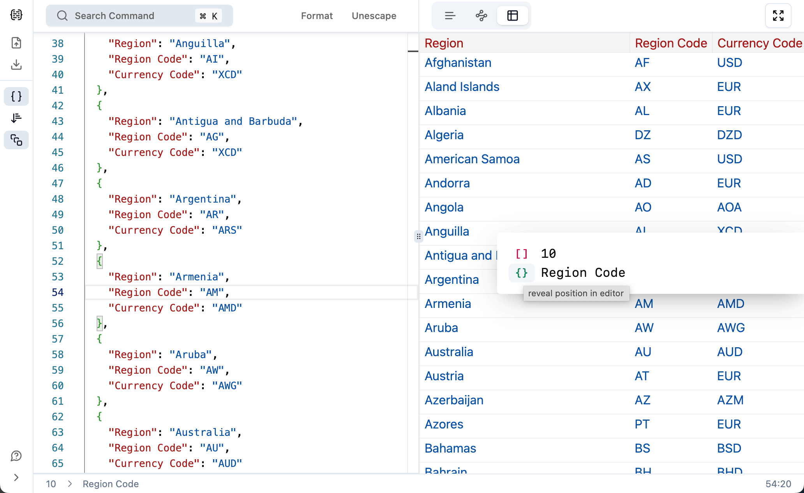
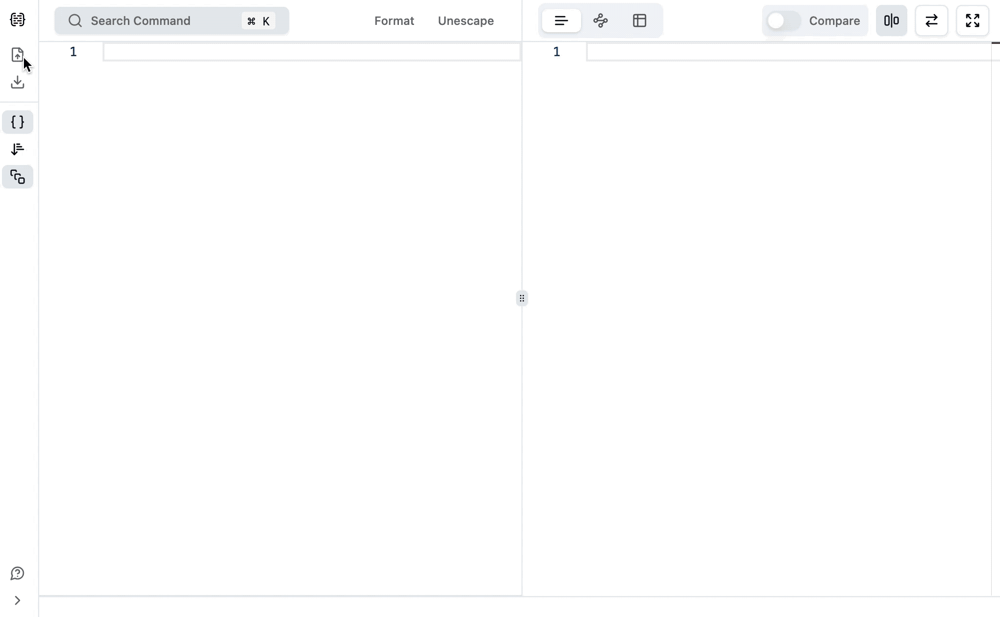

<h1 align="center">
JSON For You
</h1>

The best JSON visualization and processing tool.
 

<a href="https://json4u.com"><b>Get started</b></a> · <a href="https://json4u.cn">中文网址</a>

## Features

- Graph and Table view modes.
- Structured and text comparisons.
- Validate with error context.
- Nested parsing.
- Supporting [jq](https://jqlang.github.io/jq).
- Import and export CSV file.
- Well-designed and easy-to-use UI.

<table>
<tr>
<td></td>
<td></td>
</tr>
<tr>
<td></td>
<td></td>
</tr>
</table>

## Setup

1. Run `pnpm install` in repo's root folder.
2. Run `pnpm dev` to run the development server.
3. Open [http://localhost.json4u.com:3000](http://localhost.json4u.com:3000) with your browser to see the result.
4. Make changes to the code and see the result in the browser.

If you want to test webhook:

1. Install whcli: `npm install -g @webhooksite/cli`.
2. Get token from [webhook.site](https://webhook.site/).
3. Run `whcli forward --target=http://localhost.json4u.com:3000 --token=TOKEN_YOU_GET`

## Contribution Guide

I'm really excited that you are interested in contributing to JSON For You. Before submitting your contribution, please make sure to take a moment and read through the following guide:

1. Search for the `TODO` keyword in the code first. If it's found, then you can work base on it directly.
2. Otherwise:

   - If you want to add a new feature, provide a convincing reason to add this feature. Ideally, you should open a suggestion issue first and have it approved before working on it.
   - If fixing bug, provide a description of the bug in the PR.
   - Other minor changes that don't affect the logic of the code, such as fixing typos, translating comments into English, and adding comments, are all welcome. Just submit a PR.

3. I wish to keep JSON For You lightweight and fast. Please being aware of the number of npm dependencies and their size and don't add **unnecessary** dependencies.
4. Run `pnpm test` to make sure your code pass the core tests.

## License

[Apache](./LICENSE) License © 2022-Present [loggerhead](https://github.com/loggerhead)

