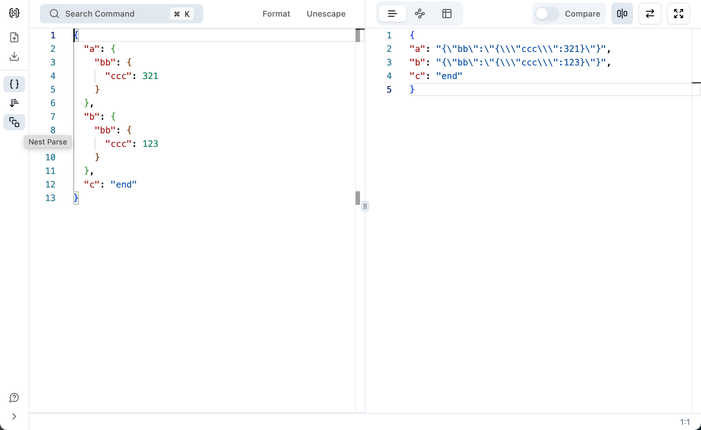
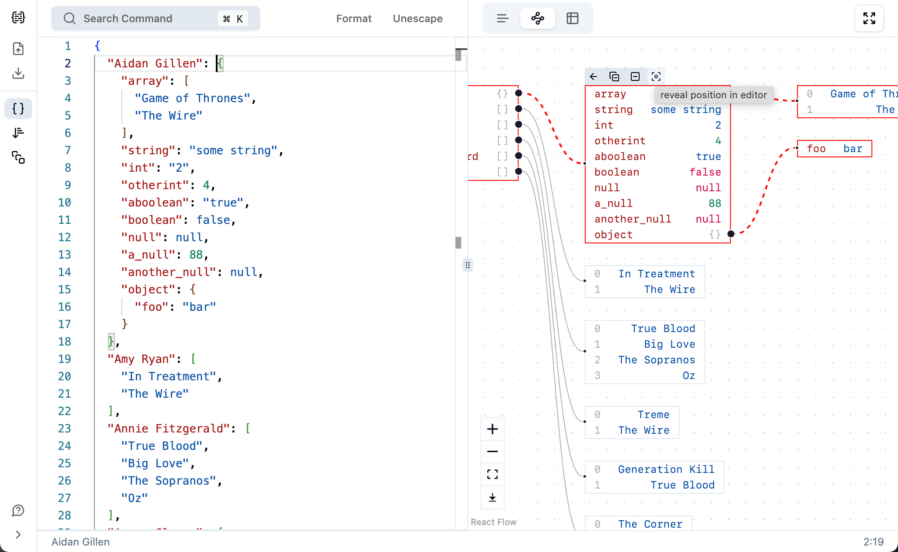

<h1 align="center">
JSON For You
</h1>

The best JSON visualization and processing tool.
 

<a href="https://json4u.com/editor"><b>Try it now</b></a> · <a href="https://json4u.cn">中文网址</a>

## Features

- Graph and Table view modes.
- Structured and text comparisons.
- Validate with error context.
- Nested parsing.
- Supporting [jq](https://jqlang.github.io/jq).
- Import and export CSV file.
- Well-designed and easy-to-use UI.

<table>
<tr>
<td></td>
<td></td>
</tr>
<tr>
<td></td>
<td></td>
</tr>
</table>

## Roadmap

- [x] Improve performance to support large files (>= 1mb).
  - [x] Only render visible nodes in graph mode.
  - [ ] Optimize performance of table mode (see [discussion](https://github.com/loggerhead/json4u/discussions/55)).
  - [ ] ~~Use wasm in web worker for parsing (use rust)~~.
  - [ ] ~~Consider [changing the editor to Ace](https://medium.com/miro-engineering/how-we-integrated-a-code-editor-on-the-miro-canvas-a41e0eff7f21).~~
- [ ] Improve interoperability between left and right panels.
  - [x] Support search in graph mode (synchronize reveal between left and right panels).
  - [ ] ~~Support search via JSON path (synchronize reveal)~~.
  - [x] Support modifications in view mode.
  - [ ] Support synchronize fold and unfold between left and right panels.
  - [x] Support displaying the key count of an object/array node after folding.
- [ ] Add a group API to support file upload and retrieval.
  - [ ] Support share with an expiration date.
  - [ ] Support auto upload local files to server.
  - [ ] Provide a command line tool ([#24](https://github.com/loggerhead/json4u/issues/24)).
  - [ ] Provide vscode plugin.
  - [ ] Support preprocessing via jq before fetch.
- [ ] Integrating AI to provide certain functions (under research).
  - [ ] Integrating basic AI capabilities in server side.
- [ ] Experience enhancement
  - [x] Support [JSON HERO](https://jsonhero.io/) like value preview
    - [x] Support for timestamp and date strings.
    - [x] Support URL parsing.
    - [x] Support image preview.
    - [ ] ~~Support for previewing leaf nodes at the same level.~~
  - [ ] Support jsonc and jsonl.
    - [ ] Design the UI for jsonl.
  - [ ] Support collapsing blocks with no differences in comparison results.
  - [ ] Change the switch to dropdown menu in comparison button.
    - [ ] Support key comparison for object nodes.
  - [ ] Support operations at the node dimension.
    - [ ] Support copy a node.
    - [ ] Support delete a node.
    - [ ] Consider supporting the ability to move a node.
    - [ ] Consider supporting the elevation of node levels.

## Setup

1. `git clone --depth 100 https://github.com/loggerhead/json4u`
2. Run `pnpm install` in repo's root folder.
3. Run `pnpm dev` to run the development server.
4. Open [http://localhost.json4u.com:3000](http://localhost.json4u.com:3000) with your browser to see the result.
5. Make changes to the code and see the result in the browser.

If you want to test webhook:

1. Install whcli: `npm install -g @webhooksite/cli`.
2. Get token from [webhook.site](https://webhook.site/).
3. Run `whcli forward --target=http://localhost.json4u.com:3000 --token=TOKEN_YOU_GET`

## Contribution Guide

I'm really excited that you are interested in contributing to JSON For You. Before submitting your contribution, please make sure to take a moment and read through the following guide:

1. Search for the `TODO` keyword in the code first. If it's found, then you can work base on it directly.
2. Otherwise:

   - If you want to add a new feature, provide a convincing reason to add this feature. Ideally, you should open a suggestion issue first and have it approved before working on it.
   - If fixing bug, provide a description of the bug in the PR.
   - Other minor changes that don't affect the logic of the code, such as fixing typos, translating comments into English, and adding comments, are all welcome. Just submit a PR.

3. I wish to keep JSON For You lightweight and fast. Please being aware of the number of npm dependencies and their size and don't add **unnecessary** dependencies.
4. Run `pnpm test` to make sure your code pass the core tests.

## Acknowledgment

- Famous library that most people know: [React](https://react.dev/), [Tailwind CSS](https://tailwindcss.com/), [Next.js](https://nextjs.org/), [Zustand](https://zustand-demo.pmnd.rs/) and [Zod](https://zod.dev/).
- [React Flow](https://github.com/xyflow/xyflow): Extensible and customizable library for building interactive graphs.
- [next-intl](https://github.com/amannn/next-intl): An out-of-the-box i18n library for Next.js that considers almost all of your usage scenarios.
- [Vitest](https://vitest.dev/): A blazing fast unit testing framework for JavaScript.
- And all the developers who contributed to open source!

## License

[Apache](./LICENSE) License © 2022-Present [loggerhead](https://github.com/loggerhead)
